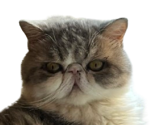

# CatCat 🐱 - Interactive iPad Game for Cats



A scientifically designed interactive entertainment game for cats, optimized for iPad and tablet devices. Based on extensive feline vision and behavior research to create the most engaging digital cat toy.

🎮 **[Play Live Demo](https://xpzouying.github.io/catcat)**

## 🌟 Features

### 🎯 Science-Based Design
- **Feline Vision Optimized**: Bright yellow target (#FFD24A) with white borders for maximum cat visibility
- **High Contrast Background**: Dark gray (#101010) background optimizes prey visibility
- **Optimal Size**: 70px target size ensures cats can distinguish colors effectively

### 🏃‍♂️ Realistic Animal Movement Simulation
- **Variable Speed System**: 0.8-1.5 screen widths/second with burst speeds of 2-3 screen widths/second
- **Palm Trajectory Pattern**: Direct movement (300-800ms) → Sharp turns (30-90°) → Brief observation (150-300ms)
- **Fake Moves**: 5% probability sudden forward dash (80-120ms) followed by retreat
- **Escape Mode**: Every 10-30 seconds, high-speed exit and re-entry from different screen edge

### 🎮 Interactive Features
- **Touch Detection**: Responsive touch/paw detection with visual feedback
- **Speed Control**: Adjustable speed slider (1-10 levels)
- **Capture Effects**: Explosive visual feedback with "Gotcha!" animation
- **Fullscreen Mode**: Optimized iPad fullscreen experience
- **Touch Feedback**: Visual ripple effects on touch interactions

### 📱 Technical Excellence
- **Cross-Platform**: Works on iPad, Android tablets, and desktop browsers
- **60fps Performance**: Smooth animations optimized for cat vision
- **Responsive Design**: Adapts to different screen sizes
- **PWA Support**: Can be installed as a web app

## 🚀 Quick Start

### Prerequisites
- Node.js 14+ 
- npm or yarn

### Installation

```bash
# Clone the repository
git clone https://github.com/xpzouying/catcat.git
cd catcat

# Install dependencies
npm install

# Start development server
npm start
```

Open [http://localhost:3000](http://localhost:3000) to view it in your browser.

### Production Build

```bash
# Build for production
npm run build

# Deploy to GitHub Pages
npm run deploy
```

## 🎯 How to Use

1. **Setup**: Place your iPad on a stable surface where your cat can comfortably reach
2. **Launch**: Open the game in fullscreen mode for best experience
3. **Adjust**: Use the speed slider to match your cat's activity level
4. **Play**: Let your cat interact with the moving target
5. **Exit**: Long-press any corner for 3 seconds to exit fullscreen

## 🔬 Scientific Background

This game is based on extensive research in feline behavior and vision:

- **Color Perception**: Cats see blue and yellow wavelengths most clearly
- **Movement Patterns**: Mimics natural prey behavior with unpredictable movements
- **Size Optimization**: Target size ensures color recognition (>20° visual angle)
- **Behavioral States**: Implements stalking, dashing, observing, and escape behaviors

## 🛠️ Technology Stack

- **Frontend**: React 18 with JavaScript
- **Styling**: Tailwind CSS
- **Animations**: Framer Motion
- **Deployment**: GitHub Pages
- **PWA**: Web App Manifest support

## 📁 Project Structure

```
catcat/
├── public/
│   ├── paofu.png          # Cat mascot and favicon
│   ├── index.html         # Main HTML template
│   ├── manifest.json      # PWA configuration
│   └── sitemap.xml        # SEO sitemap
├── src/
│   ├── components/
│   │   ├── GameArea.js    # Main game logic and movement patterns
│   │   ├── Mouse.js       # Target object with visual effects
│   │   ├── SpeedControl.js # Speed adjustment slider
│   │   ├── TouchFeedback.js # Touch interaction effects
│   │   └── CaptureEffect.js # Success animation
│   ├── App.js            # Main app with fullscreen logic
│   └── index.js          # React entry point
└── README.md             # This file
```

## 🎨 Customization

### Adjusting Colors
Edit `src/components/Mouse.js` to change target colors:
```javascript
const getMouseColor = () => {
  return '#FFD24A'; // Bright yellow optimized for cats
};
```

### Modifying Movement Patterns
Edit `src/components/GameArea.js` to adjust behavior:
```javascript
// Adjust speed ranges
case 'stalking':
  targetSpeed = (0.8 + Math.random() * 0.7) * screenWidthPerSecond / 60;
  break;
```

## 🐱 Cat Testing Tips

1. **Start Slow**: Begin with speed level 3-4 for most cats
2. **Observe Behavior**: Watch for head movements and paw twitches indicating interest
3. **Session Length**: Keep sessions to 5-10 minutes to prevent overstimulation
4. **Screen Protection**: Consider a screen protector for your device
5. **Supervision**: Always supervise your cat during play

## 🤝 Contributing

1. Fork the repository
2. Create a feature branch (`git checkout -b feature/amazing-feature`)
3. Commit changes (`git commit -m 'Add amazing feature'`)
4. Push to branch (`git push origin feature/amazing-feature`)
5. Open a Pull Request

## 📄 License

This project is licensed under the MIT License - see the [LICENSE](LICENSE) file for details.

## 🙋‍♂️ Support

- **Issues**: Report bugs or request features via GitHub Issues
- **Discussions**: Join conversations in GitHub Discussions
- **Email**: Contact the development team

## 🏆 Acknowledgments

- Feline behavior research from animal psychology studies
- Cat vision science from veterinary ophthalmology research
- Pet owners who beta tested with their cats
- The React and web development community

---

**Made with 💝 for cats everywhere** 🐾

*Keep your feline friends entertained while you're away!*